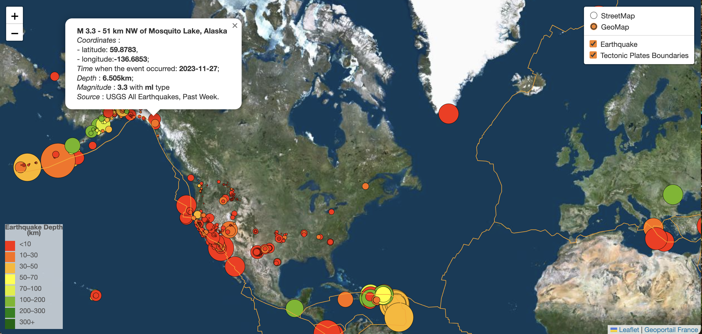

# leaflet-challenge
Visualization of USGS Earthquakes data.
## Repository Contents 
### Leaflet-Part-1-2
  - *index.html*: structure of the webpage.  
      
  - **static** directory contains:
    - **css** subdirectory with *style.css* that adjusts style elements of the page.  
    - **js** subdirectory with:  
           - *logic.js* which is the core JavaScript file, responsible for plotting a map using [Leaflet](https://leafletjs.com/index.html) (open-source JavaScript library for mobile-friendly interactive maps) and [USGS GeoJSON Feed](https://earthquake.usgs.gov/earthquakes/feed/v1.0/geojson.php) as a data source.   
          -  *datajs.js*: contains the GeoJSON [input](https://github.com/fraxen/tectonicplates) data with boundaries of tectonic plates.  
## Usage
 - *Localy*: open the *index.html* in a web browser (such as Chrome) using Visual Studio Code, along with a suitable extension for live previews.  
 - *Online*: preview visualization on GitHub Pages [here](https://valentynak17.github.io/leaflet-challenge/). 
## Info Resources
 - [Tile layers list to choose](https://leaflet-extras.github.io/leaflet-providers/preview/)
 - [Source for understanding how to colour markers based on earthquake depth](https://earthguideweb-geology.layeredearth.com/earthguide/lessons/e/e3/e3_2.html)
 - Color Scales: 
    - [Chroma-js](https://www.npmjs.com/package/chroma-js)
    - [Stackoverflow](https://stackoverflow.com/questions/32742027/continous-colors-for-choropleth-in-leaflet)
    - [colours mix case](https://stackoverflow.com/questions/48696395/leaflet-mixing-continuous-and-discrete-colors)
    - [Import chroma.js](https://www.jsdelivr.com/package/npm/chroma-js)
- [Adding of Legend to a map](https://gis.stackexchange.com/questions/193161/add-legend-to-leaflet-map)
- [Syntax of ? operator in js](https://www.freecodecamp.org/news/how-the-question-mark-works-in-javascript/)
- [Unix into regular time](https://usefulangle.com/post/258/javascript-timestamp-to-date-time)
